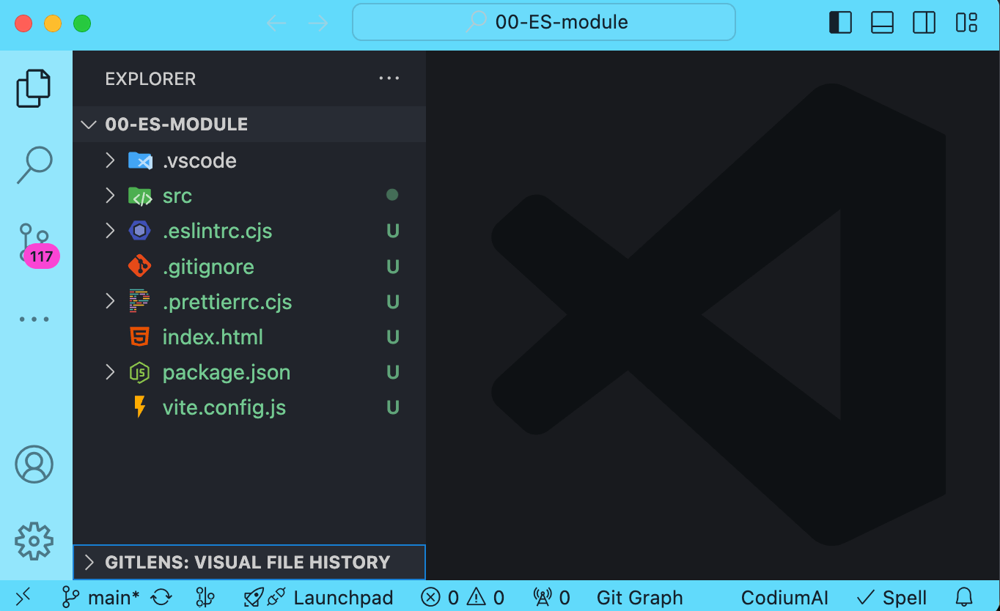

# Hello React
## STEP 1
- install node.js 18.x
- install vscode

## STEP 2 - Create New Project
```bash
npm create vite@latest my-react-app -- --template react
```
- Reference: https://vitejs.dev/guide/

## STEP 3
- Use vscode to open the project
- Open then terminal in vscode, navigate to Terminal / New Terminal
- `npm run dev`
- Open `http://localhost:5173/` and enjoy

# Extensions (Optional)
## STEP 1 - install vscode extensions
- https://marketplace.visualstudio.com/items?itemName=Gruntfuggly.todo-tree
- https://marketplace.visualstudio.com/items?itemName=dbaeumer.vscode-eslint

## STEP 2 - ESLint autofix
- Open `00-ES-module` Project, theme will be blue
  > 
- `npm install`
- Open VSCode settings, navigate to / Preferences / Settings (Ctrl + ,), and click `Open Settings (JSON)` icon
  >  
- Add new settings
```json
{
 "emmet.includeLanguages": {
    "javascript": "javascriptreact"
  },
 "editor.codeActionsOnSave": {
    "source.fixAll.eslint":   "explicit"
  }
}
```

## STEP3
- Open `src/main.js`
- Enter code `var a=3`, if there is a red tip, it is correct.
  > 
- It will automatically fix `var a=3` to `const a = 3;` after save file
- Enjoy it


# Practice questions - TodoListApp
- Use `Vite` to create `vanilla` project
- Develop `TodoListApp` using Vanilla JS
- Required sepc
  1. Input field, Add a new todo when pressing the entry key.
  2. list all Todo Restuls.
  3. Click todo item to switch complete
  4. Add Filter Todos (Nice to have)
- figma link https://www.figma.com/design/WjH0KtgMDe4iEbIQAmNUS5/To-Do-List?node-id=0-1&t=gWIZObxPL0vrginW-0